# Hi, I'm Prithwijit Ghosh 👋

🧑‍💻 **Data Scientist @ Accenture Technology** &nbsp;·&nbsp; 🎓 M.Sc. Statistics, IIT Kanpur

📈 Forecasting &nbsp;·&nbsp; ⚠️ Risk Scoring &nbsp;·&nbsp; 🚨 Anomaly Detection &nbsp;·&nbsp; ⚙️ MLOps &nbsp;·&nbsp; 🤖 Applied ML & AI Systems

 

 

## About

I build applied **ML** and **AI systems** end-to-end — from $\color{orange}{\text{statistical modeling}}$ and *forecasting* to $\color{skyblue}{\text{agentic AI pipelines}}$ and *production deployment*. Currently working as a **Data Scientist at Accenture Technology**, with a background in **Statistics from IIT Kanpur**. I care less about the buzzwords and more about whether the thing I build actually *ships*, *scales*, and holds up under real-world data.

- 🔭 Currently building **agentic RAG systems**, $\color{orange}{\text{forecasting models}}$, and *risk-scoring pipelines*
- 🧠 Grounded in **statistics** — comfortable moving between *classical models* and modern $\color{skyblue}{\text{deep learning}}$ / **LLM-based systems**
- ⚙️ Interested in taking models from *notebook to production*: **APIs**, **containers**, and **CI/CD** — not just accuracy metrics
- 📫 Reach me at **ghoshprithwijit39@gmail.com**

 

## Tech Stack

### Languages & Data

### Machine Learning

### GenAI & AI Systems

### Engineering & MLOps

### Analytics & Tools

 

## GitHub Activity

Numbers only tell part of the story, but they're a useful starting point. Below is a **live snapshot** of how I actually work day to day — total $\color{orange}{\text{contributions}}$ across public and private repositories, the *languages* I reach for most often when building models and pipelines, and how consistently I show up to commit code. I care more about *shipping working systems* than chasing green squares, but tracking this activity keeps me honest about **momentum over time**. It's regenerated **automatically every night**, so what you're seeing here is never stale — always a $\color{skyblue}{\text{current reflection}}$ of ongoing work.

<table>
<tr>

<td align="center">

</td>

<td align="center">

</td>

<td align="center">

</td>

</tr>
</table>

*These cards refresh **automatically every day** through a scheduled $\color{orange}{\text{GitHub Actions}}$ workflow, pulling fresh data straight from the GitHub API — no manual updates, no stale screenshots, just an **always-current** view of recent activity across all my repositories.*

  

 

Statistics at the foundation. Machine learning in practice. AI at the edge.

